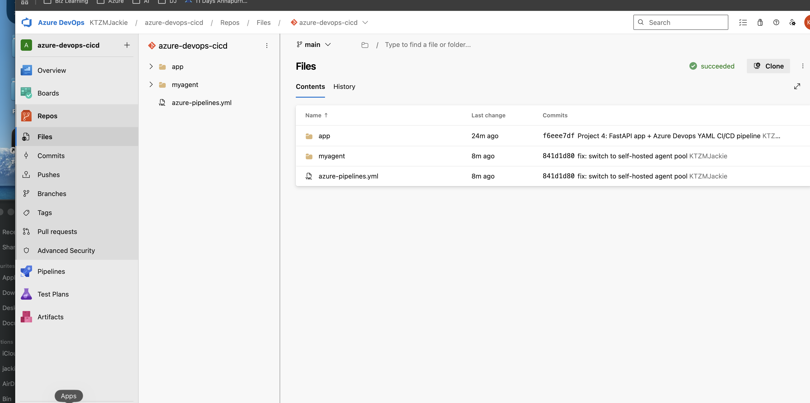
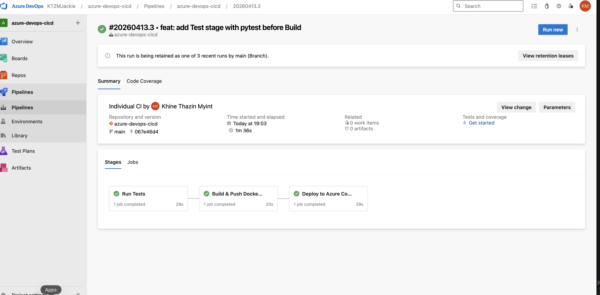

# azure-devops-cicd

A production-style CI/CD pipeline built with Azure DevOps, automating the full lifecycle of a containerised FastAPI application — from automated testing to deployment on Azure Container Apps.

## Pipeline Overview

Every git push to main triggers a 3-stage pipeline: Test → Build → Deploy

| Stage | What happens |
|---|---|
| Test | pytest runs automatically — build blocked if tests fail |
| Build | Docker image built for linux/amd64 and pushed to ACR |
| Deploy | Azure Container Apps updated with new image revision |

## Architecture

Developer → git push → Azure DevOps Pipeline
                            ├── Stage 1: pytest
                            ├── Stage 2: docker buildx → ACR
                            └── Stage 3: az containerapp update
                                              ↓
                                   Azure Container Apps (live)

## Tech Stack

| Layer | Tool |
|---|---|
| App | Python / FastAPI |
| Containerisation | Docker (buildx — linux/amd64) |
| Container Registry | Azure Container Registry (ACR) |
| CI/CD | Azure DevOps YAML Pipelines |
| Hosting | Azure Container Apps |
| Testing | pytest |

## Key Features

- 3-stage YAML pipeline: Test → Build → Deploy
- Automated pytest on every push — pipeline fails fast if tests break
- Multi-platform Docker build via docker buildx
- Zero-downtime deployment via Azure Container Apps revisions
- ACR image tagged with Azure DevOps Build ID for full traceability

## Live Endpoint

| Endpoint | URL |
|---|---|
| Root | https://ca-devops-cicd.politemushroom-670b9f82.southeastasia.azurecontainerapps.io/ |
| Health | https://ca-devops-cicd.politemushroom-670b9f82.southeastasia.azurecontainerapps.io/health |

## Screenshots

echo "" >> README.md
echo "" >> README.md

## How to Run Locally

Install dependencies and run:
    cd app
    pip install -r requirements.txt
    uvicorn main:app --reload

Run tests:
    cd app
    pytest test_main.py -v
